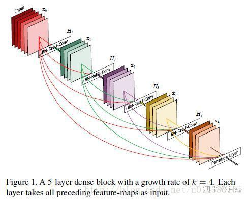

此项目完全是照搬的rasbt大佬的内容，自己只是照着抄了一遍，上传github，只是为了监督自己，原github地址：https://github.com/rasbt

### 2023-04-21
完成了pytorch/cnn/cnn-mobilenet.py
```commandline
在每个Sequential中，只有第一个BatchNorm2d才会向后面的Sequential传递值。

具体还得细看MobileNet V1-V3的论文

另外还得多看每个层，每个参数的作用
```


```
LeNet5就是经过一个卷积模块提取特征以后，采用全连接层进行分类，最后使用softmax输出
原作者的代码中，卷积层转为线性层的时候，线性层的输入通道不对，导致出错，我在转为线性层之前，加了一个自适应池化层，将输出图片大小转为50x50
```
```
流程：[卷积层，Tanh，MaxPool2d] -> [卷积层，Tanh，MaxPool2d] -> AdaptiveAvgPool2d() -> Flatten() -> [线性层，线性层，线性层，线性层，线性层] -> SoftMax
```


### 2023-04-20



```
    与L层传统卷积神经网络有L个连接不同，DenseNet中每个层都和其之后的层有连接，因此L层的DenseNet有L(L+1)/2个连接关系。
    对于每一层，它的输入包括前一层的输出和该层之前所有层的输入。DenseNet有几个引人注目的优势：
        1. 缓解了梯度消失
        2. 加强了特征传播
        3. 增强了特征复用
        4. 减少了参数量
    
    - 一个反直觉的事实是相比传统卷积神经网络而言，DenseNet的参数量更少，这是因为它每一层的通道数都大大缩减了；
    - 另一个比较大的优势是提高了整个网络的信息和梯度流动，这使得网络更容易。每一层都可以得到来自损失函数的梯度和原始的输入信号，这相当于深度监督的影响，对网络训练很有帮助；
    - 同时DenseNet还有正则化的影响，它使得面对小样本任务时过拟合的风险大大降低；
```

```
完成pytorch/cnn/cnn-densenet121-cifar10.py

训练精度和验证精度相差太多，怀疑是模型太强，导致过拟合
```


### 2023-04-19
    ```
    完成pytorch/cnn/cnn-alexnet-cifar10.py
    
    但是训练的时候训练集能达到90%+,但是验证集只有70%+
    
    最后在训练接，验证集和测试集上的准确率全部都是70%+
    
    暂时还不清楚是什么原因！！！


    完成pytorch/cnn/cnn-allconv.py
    
    模型训练的步骤：
        1. 加载模型和数据到GPU
        2. 经过模型训练
        3. 通过损失函数计算损失
        4. 优化器参数清零
        5. 调用损失函数的反向传播
        6. 利用反向传播进行参数更新 
        7. 优化器更新值
        8. 循环1-7步
    ```


### 2023-04-17
   ```
   完成pytorch-lightning/cnn/cnn-alexnet-cifar10.py
   
   from collections import Counter 函数可以跟踪可迭代对象中每个元素出现的次数
   Counter().most_common() 函数可以获取计数器字典中出现次数最多的前n个元素，并按照他们的频率进行排序
   ```