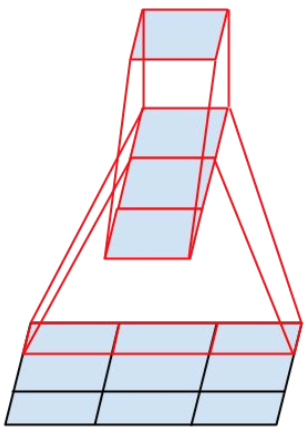

此项目将照搬网上的一些开源模型，上传github，只是为了监督自
己，会在每个模型实现的背后，放上原链接地址

### 已实现

- Inception V4 (2023.04.27)
  - 论文地址：https://arxiv.org/abs/1602.07261
  - 论文翻译地址：
  - 代码参考地址：https://github.com/zhulf0804/Inceptionv4_and_Inception-ResNetv2.PyTorch/blob/04ca904e8469d685787288f459651e2a8d4ef227/model/inceptionv4.py
  - 开创性内容：
  - 不明白的地方：
    - 
    - 
    - 
    - 
    - Inception V4中的这两个部分是哪里来的，没有输入，却有输出，而且代码中也找不到这些branch

- Inception V3 (2023.04.25)
  - 论文地址：https://arxiv.org/pdf/1512.00567.pdf
  - 论文翻译地址：http://noahsnail.com/2017/10/09/2017-10-09-Inception-V3%E8%AE%BA%E6%96%87%E7%BF%BB%E8%AF%91%E2%80%94%E2%80%94%E4%B8%AD%E8%8B%B1%E6%96%87%E5%AF%B9%E7%85%A7/
  - 代码参考地址：https://github.com/pytorch/vision/blob/0d75d9e5516f446c9c0ef93bd4ed9fea13992d06/torchvision/models/inception.py#L28
  - 开创性内容：
    - 论文中的General Design Principles（通用设计原则）指出了设计网络时，怎样更好
    - 采用分离卷积，将5x5的卷积块，分解成两个3x3的卷积块，以达到降低参数量的效果
    - 采用不对称卷积，并论证了在[12,20]大小的特征图上采用不对称卷积会获得非常好的结果
    - 
    - 
  

- Inception V2
  - 论文地址：https://arxiv.org/pdf/1502.03167.pdf
  - 论文翻译地址：http://noahsnail.com/2017/09/04/2017-09-04-Batch%20Normalization%E8%AE%BA%E6%96%87%E7%BF%BB%E8%AF%91%E2%80%94%E2%80%94%E4%B8%AD%E8%8B%B1%E6%96%87%E5%AF%B9%E7%85%A7/
  - 代码参考地址：https://blog.csdn.net/shanglianlm/article/details/99132682
  - 单独打印model的时候可以正常显示，但是保存结构图的时候出错了，提示Error occurs, No graph saved，暂时还没解决
  - 开创性内容：
    - 提出了Batch Normalization（批标准化），通过修改层输入的均值和方差，来减少梯度对参数或它们的初始值尺度上的依赖
    - 通过Batch Normalization代替Dropout函数
  - 白化：去除输入数据的冗余信息，假设训练数据是图像，由于图像中相邻像素之间具有很强的相关性，所以用于训练时输入是冗余的；白化的目的就是减低输入的冗余性

  

- ResNext &emsp; (2023.04.24)
  - 论文地址：https://arxiv.org/pdf/1611.05431.pdf
  - 论文翻译地址：https://zhuanlan.zhihu.com/p/120352034
  - 代码参考地址：https://github.com/pytorch/vision/blob/main/torchvision/models/resnet.py
  - 开创性内容：
    - 与ResNet相比，ResNeXt-50(32x4d)对Bottleneck中的3x3卷积块，分离为32个通道共分离4次，每个组有一个卷积核与其进行卷积操作。（分组卷积层）
  - 消融实验： 假设在某目标检测系统中，使用了A，B，C，取得了不错的效果，但是这个时候你并不知道这不错的效果是由于A，B，C中哪一个起的作用，于是你保留A，B，移除C进行实验来看一下C在整个系统中所起的作用。

- ResNet
  - 论文地址：https://arxiv.org/abs/1512.03385
  - 论文翻译地址：http://noahsnail.com/2017/07/31/2017-07-31-ResNet%E8%AE%BA%E6%96%87%E7%BF%BB%E8%AF%91%E2%80%94%E2%80%94%E4%B8%AD%E8%8B%B1%E6%96%87%E5%AF%B9%E7%85%A7/
  - 代码参考地址：https://github.com/pytorch/vision/blob/main/torchvision/models/resnet.py
  - TestImages文件夹为person.jpg经过网络以后，每一层的输出图
  - 开创性的内容：
    - 添加了残差连接模块，这样做的好处是即使在网络很深的时候，也能知道最开始输入的图片，可以减少分辨率缩小的过程中信息的丢失
    - ResNet中提到的退化问题可能是因为网络层数变深以后，导致处理的信息高度抽象，进而造成网络退化

- GoogleNet_V1 &emsp; (2023.04.23)
  - 论文地址：https://arxiv.org/abs/1409.4842
  - 论文翻译地址：http://noahsnail.com/2017/07/21/2017-07-21-GoogleNet%E8%AE%BA%E6%96%87%E7%BF%BB%E8%AF%91%E2%80%94%E2%80%94%E4%B8%AD%E8%8B%B1%E6%96%87%E5%AF%B9%E7%85%A7/
  - 代码参考地址：https://github.com/pytorch/vision/blob/main/torchvision/models/googlenet.py
  - 开创性的内容
    - 提出了Inception模块，可以将输入经过多个不同的处理后，进行融合，同时传给下一层
    - 采用1x1卷积层

- VGGNet
  - 论文地址：https://arxiv.org/abs/1409.1556
  - 论文翻译地址：http://noahsnail.com/2017/08/17/2017-08-17-VGG%E8%AE%BA%E6%96%87%E7%BF%BB%E8%AF%91%E2%80%94%E2%80%94%E4%B8%AD%E8%8B%B1%E6%96%87%E5%AF%B9%E7%85%A7/
  - 代码参考地址： https://github.com/pytorch/vision/blob/main/torchvision/models/vgg.py
  - 开创性的内容
    - 第一卷积层使用更小的卷积核和更小的步长
    - 使用了更深的网络
    - 对原始图像的像素值减去RGB三通道的均值进行归一化，使其具有零均值
    - 抛弃AlexNet中的局部响应归一化，使用批量归一化

- AlexNet
  - 论文地址：https://proceedings.neurips.cc/paper/2012/file/c399862d3b9d6b76c8436e924a68c45b-Paper.pdf
  - 论文翻译地址：http://noahsnail.com/2017/07/04/2017-07-04-AlexNet%E8%AE%BA%E6%96%87%E7%BF%BB%E8%AF%91/
  - 代码参考地址：https://github.com/pytorch/vision/blob/main/torchvision/models/alexnet.py
  - 开创性的内容
    - 采用了ReLU激活函数
    - 采用两个GPU，只在特定层进行通信
    - 局部响应归一化 LRN（虽然后面研究表明，LRN几乎没用）
    - 重叠池化 
      - 步长小于池化核的大小，即每次池化时，会有重叠的部分，称为重叠池化
      - 步长等于池化核的大小，即每次池化时，没有重叠的部分，则称为传统池化
    - Dropout函数